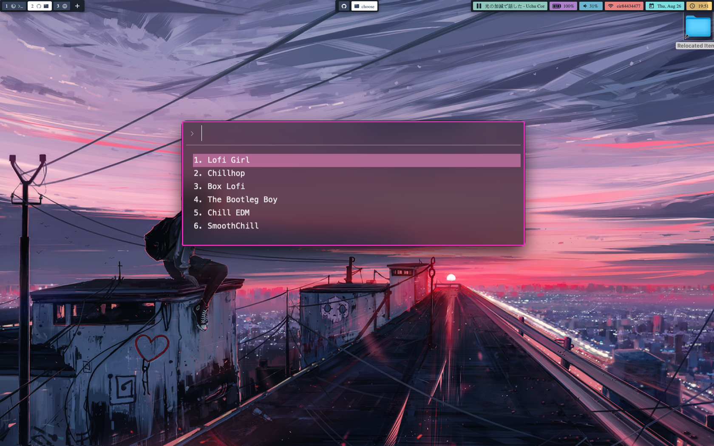

# Rofi-Beats-Linux
A rofi-like menu for playing lofi radio stations on Linux (may work on MacOS, not sure!).
🐧🐧🐧


## Dependencies
- rofi
- mpv
- notify-send
- python3

## Installation

To install `notify-send` and `rofi` enter the following:

For Ubuntu:
```
$ sudo apt install rofi notify-osd mpv
```
For Arch Linux:

```
sudo pacman -S rofi notify-osd mpv
```

Once you have the dependencies installed, simply execute the file 'rofi-beats-linux.py'. It may require run permissions.

```
$ git clone https://github.com/GoodGuyPat/rofi-beats-linux
$ cd rofi-beats-linux
$ chmod +x rofi-beats-linux.py
```
Now the script is ready to use!


```
python3 rofi-beats-linux.py
```

If you want your launchers to find it, you may want to move it to your bin directory


```
$ mv rofi-beats-linux.py ~/.local/bin/
```
## Usage

The script toggles the radio on and off depending on it's current state.

The script first checks to see if an instance of the radio is already playing.

If it finds the script is already playing music it kills the music. If the radio is not already playing it will launch the list of stations you can choose from.

The output of the player is piped to a text file that can be read by your applications (to get the title of the song being currently played, for example).

The player is also connected to a socket so that you can controll it externally. For example, you may want to bind a key (or allow your programs) to pause and resume the playing (tip: the command for that will be `echo '{ "command": ["cycle", "pause"] }' | socat - /tmp/mpvsocket` ). I have used this to show the song being played in my status bar (waybar) and to play/pause by clicking the song name.

